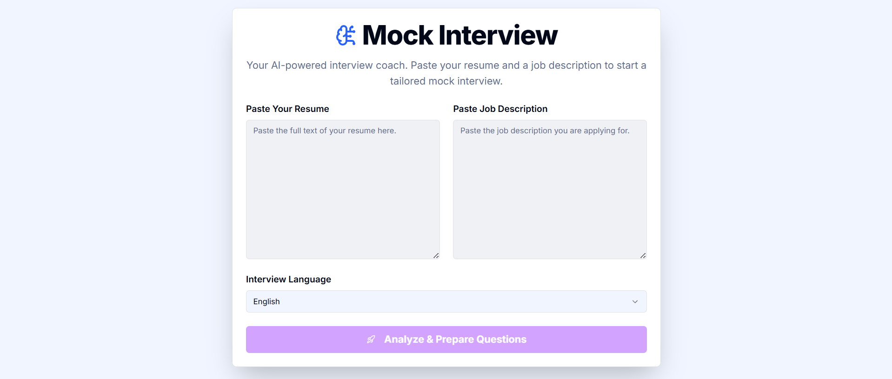
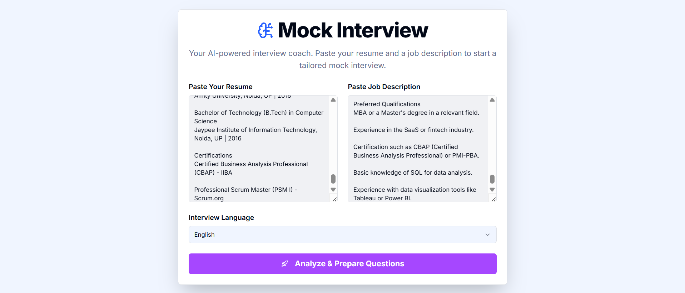
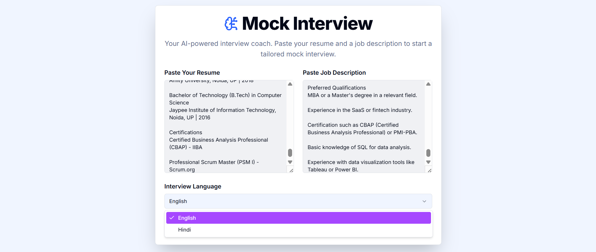
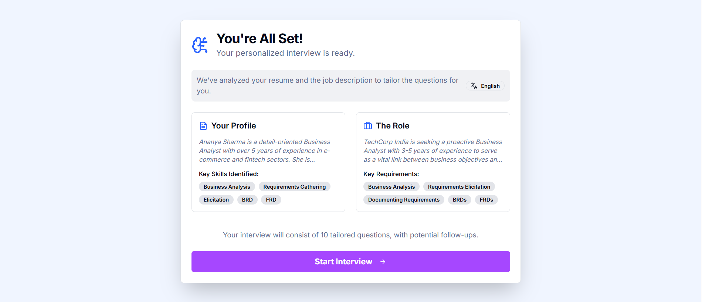
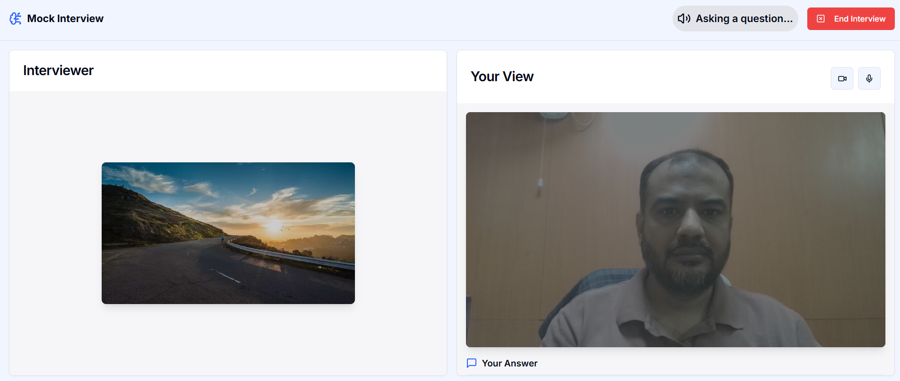
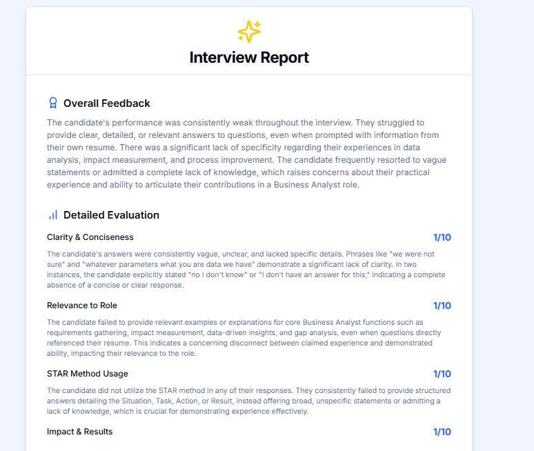

Simply put your Gemini API Key in the .env file, and run on your local machine.
---

## ✨ Features

- **Document Upload**  
  Upload or paste a resume and job description directly into the app.

- **Information Extraction**  
  Automatically extract key details from the uploaded documents using NLP pipelines.

- **Tailored Question Generation**  
  Generate ~10 interview questions customized to the candidate’s resume and the specific job description.  
  Uses an LLM to identify which concepts are most relevant to test.

- **Virtual Interview Simulation**  
  Simulated interviewer video with the candidate’s live camera feed.  
  Includes two-second natural delays after clicks to mimic real interaction pacing.

- **Verbal Question Delivery**  
  Interview questions are delivered through a synthetic interviewer voice.  
  No visual text is shown, enhancing the realism.

- **Response Processing & Follow-Up**  
  Spoken answers are processed in real-time.  
  Follow-up questions are generated when deeper exploration is needed.

- **Camera + Audio Integration**  
  Live camera feed and microphone capture allow audio-driven analysis and dynamic follow-up.

---

## 🛠️ Tech Highlights

- **Frontend**: Next.js + TypeScript  
- **NLP**: Resume and job description parsing  
- **LLM**: Question generation and follow-up logic  
- **Media**: Real-time camera and microphone integration  
- **Voice Simulation**: Text-to-speech for realistic interviewer voice  

---

## 📸 Screenshots

| Feature | Screenshot |
|---------|------------|
| The App Frontend |  |
| Upload Resume & Job Description |  |
| Selected Language (English/Hindi) |  |
| Extracted Information from CV and JD |  |
| Virtual Interview Simulation |  |
| Final Report |  |

---

## Feel free to ping me on my Linked https://www.linkedin.com/in/mohdnaved/ 

